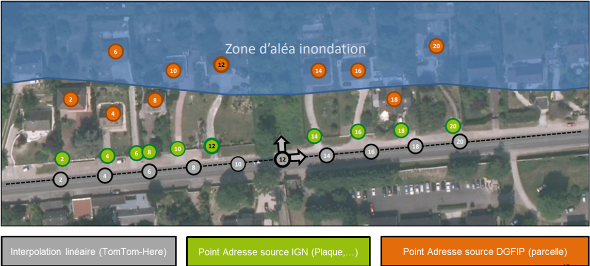
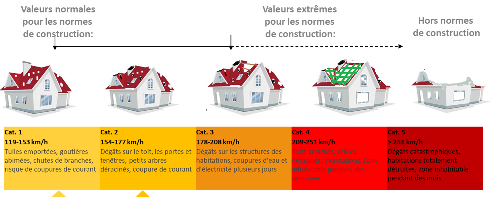

```{r setup, include=FALSE}
knitr::opts_chunk$set(echo = TRUE)
require(pacman)
pacman::p_load(c("data.table","dplyr","knitr","sf","viridis","leaflet","plotly",
                 "RColorBrewer","units","mapsf","cartography","fitdistrplus",
                 "extRemes","evd","stars","gstat"), 
               install = F, update = F, character.only = T)
```

# FOCUS - RISQUE OURAGAN EN MARTINIQUE

Avant toute chose, il semble important de rappeler que le cours n°2 traite partiellement de ce sujet. Il sera donc utile de se référer au dernier TP. De plus un exemple d'outil R pour la consultation des ouragans (écrit par Sean JUSTICE) est disponible [ici](https://coveaprm.shinyapps.io/Hurricane_viewer/), tout comme son [blog](https://nycdatascience.com/blog/student-works/visualizing-hurricane-data-with-shiny/).

## Les étapes d'un modèle CAT

Pour modéliser les impacts économiques d'un modèle dit de Catastrophe ou Modèle Cat (applicable aux risques extrêmes) nous distinguerons plusieurs composantes. Parmi lesquelles :

1.  L'aléa : ce module permet de comprendre le risque naturelle modélisé
2.  L'exposition : il s'agit de comprendre qui est exposé à l'aléa
3.  La vulnérabilité : on peut être exposé à un aléa et y être plus moins sensible / vulnérable
4.  La résilience : parfois confondu avec la vulnérabilité, c'est une mesure des capacités à faire face après l'évènement, le Japon a des capacités de reconstruction post tremblement de terre très forte.
5.  Les pertes : une fois les étapes précédentes étudiées, il est possible d'analyser les pertes en les intégrant à un modèle

### 1. L'aléa

Le cours jusqu'à aujourd'hui a principalement porté sur cette partie, qui est très souvent liée au climat ou a des notions de physique et de connaissance / compréhension du monde qui nous entoure. C'est la partie la plus complexe à modéliser.

Une façon de décrire l'aléa ouragan, pour la partie vent, consiste à déterminer l'intensité de l'évènement selon l'échelle de Saffir-Simpson


NB : 1 noeud (kn) est équivalent à 1.852 km/h, ainsi 64 nœuds, la vitesse de vent moyen d'un ouragan de 1ère catégorie, est d'environ 119 km/h.

### 2. L'exposition

"Un bon schéma vaut mieux qu'un long discours"



Cette image illustre que selon le point que l'on utilisera pour identifier un bien assuré, la précision utilisée permettra d'estimer plus ou moins correctement l'exposition au risque inondation.

L'opération permettant de passer d'une adresse à une coordonnée géographique s'appelle le **Géocodage** qui est devenu une évidence grâce à Google Maps.

Selon les aléa étudiés, l'exposition peut être ciblée (comme sur l'exemple précédent de l'inondation) ou non, ainsi le risque de tempête ou d'ouragan va concerner toute personne et tout bâtiment présent dans une zone où les ouragans peuvent sévir.

### 3. La vulnérabilité

Si un bien est exposé, se pose la question de sa vulnérabilité. Les normes de construction française permettent d'estimer des vitesses de vent pour lesquelles les dommages devraient inexistant ou faible (selon l'entretien des biens). Cela s'applique très bien à la résistance au vent. Concernant l'inondation, si une maison est en zone inondable et qu'elle est construite sur pilotis, elle sera moins vulnérable.



### 4. La résilience

Cette étape consiste à évaluer si un pays, une zone géographique, pour les ouragans en Martinique : l'île de la Martinique, est en capacité à faire face aux conséquence d'un évènement extrême. En général, il y a des limites matérielles et humaines qui sont à prendre en considération. Le dépassement de ces limites va engendrer un coût supplémentaire, on peut parler de sur-inflation.

Typiquement, si 5 à 10 % des maison d'une zone nécessitent des interventions urgentes pour être mises en sécurité (bâchage, étayage...) la question des limites peut se poser sur le matériel --- en avons nous en quantité suffisante ? --- et aussi sur le plan humain --- avons nous assez de couvreurs pour réparer les toits ?

Maintenant, si cette même zone fait face non plus à 5 à 10 % de dégâts mais à plus de 80%, ces limites seront atteintes, les travaux seront forcément plus long et forcément plus cher. Le marché de l'offre et la demande feront que les prix augmenteront et ce de manière très sensibles.

Pour les ouragans extrêmes, cette limite, ce point de rupture est au niveau de la catégorie 3. Nous parlons ici que de l'aspect financier, il faut rappeler que de telles catastrophes peuvent générer des problèmes plus grave, liés à la **survie des personnes** et notamment à l'approvisionnement en eau potable, en nourriture puis en électricité... Sans cela pas de réparation possible !

### 5. Les pertes

Dernière étape de la modélisation Cat, il s'agit de faire le lien entre tous les éléments avec un modèle statistique (une loi) ou d'autres théories. Il est possible d'avoir des approches macro-écnomiques (comme nous le ferons dans le cours) et des approches plus fines et plus locales, qui nécessitent des données précises. Des pistes de réflexion seront données en fin de cours pour trouver ces éléments précis, au niveau du marché, afin d'élargir le champ des possibles.

## Application aux ouragans en Martinique

Il s'agit ici d'appliquer les notions présentée ci-dessus à notre sujet.

### 1. Les ouragans en Martinique

#### 1.1. Les évènements historiques

Dans cette partie, il s'agira de reprendre en partie ce qui a été fait lors du TP précédent en se focalisant uniquement sur la Martinique et sur l'extraction des trajectoires dangereuses.

Afin de définir la taille du Buffer, je propose une étape préalable d'analyse des autres critères de la base Hurdat, à savoir la distance à laquelle il est possible d'observer des vents supérieurs ou égaux à 64 nœuds.

```{r Select_Tracks}
# 1 chargement des données HURDAT
source("./pgm/hurdat.R")
Atlantic <- data.table(get_hurdat("AL"))
# Description des données : https://www.aoml.noaa.gov/hrd/hurdat/hurdat2-format.pdf

# 2 - Nettoyage et mise en forme
Atlantic <- Atlantic[!is.na(DateTime)]
# On va créer des colonnes pour les couleurs à tracer, la catégorie et en fonction de l'intensité de l'évènement à chaque instant t matérialisé par un point
Atlantic <- Atlantic %>% mutate(Categ = as.factor(case_when(Status == 'HU' ~ 'Hurricane',
                                                            Status == 'TS' ~ 'Tropical Storm',
                                                            Status == 'TD' ~ 'Tropical Depression',
                                                            TRUE ~ 'Other')),
                                intensity = as.factor(case_when(Status == 'HU' ~ paste0('Hurricane: ',
                                                                                        case_when(Atlantic$Wind >= 137 ~ 'Cat5',
                                                                                                  (Atlantic$Wind >= 113 & Atlantic$Wind < 137) ~ 'Cat4',
                                                                                                  (Atlantic$Wind >=  96 & Atlantic$Wind < 113) ~ 'Cat3',
                                                                                                  (Atlantic$Wind >=  83 & Atlantic$Wind <  96) ~ 'Cat2',
                                                                                                  (Atlantic$Wind >=  64 & Atlantic$Wind <  83) ~ 'Cat1')),
                                                                Status == 'TS' ~ 'Tropical Storm', 
                                                                Status == 'TD' ~ 'Tropical Depression',
                                                                TRUE ~ 'Other')),
                                Year = as.numeric(year(DateTime)),
                                Month = as.numeric(month(DateTime)))

# 3 - Transformation en format spatial
# 3.1 - transformation spatiale
# Les données de projection sont décalée sur la longitude, avant de transformer la base en données spatial il faut donc les corriger
Atlantic$Lon[Atlantic$Lon < -300] <- Atlantic$Lon[Atlantic$Lon < -300] + 360

# Rappel : https://epsg.io/4326 : projection de Mercator
AtlanticSF <- st_as_sf(Atlantic, coords = c("Lon","Lat"), crs = 4326)
# Visualiser les points 
# plot(AtlanticSF["intensity"])

# 3.2 - Passage de points à lignes
Tracks <- AtlanticSF %>% 
  group_by(Key) %>%
  summarise(do_union = FALSE) %>%
  st_cast("LINESTRING")

# 3.2.2 - Nettoyage : certains systèmes n'ont qu'on point et ce type de géométrie n'est pas comaptible avec les lignes... 
rmv <- Atlantic[,list(points = length(DateTime)), by = list(Key)][points == 1]

Tracks <- Tracks[!(Tracks$Key %in% rmv$Key),]

# 4 - Chargement des contours de la martinique
# 4.1 - Base à la maille commune
mtq <- mapsf::mf_get_mtq()

# 4.2 - Agréger des polygones pour obtenir l'île dans son intégralité
mtq_u <- st_union(mtq)
plot(st_geometry(mtq), col="lightblue")
plot(st_geometry(mtq_u), add=T, lwd=2, border = "red")

# 5 - Analyse de la propagation des vents 
# 5.1 - Distance moyenne par direction d'un vent supérieur ou égal à 64 noeuds (119 km.h limite ouragan), en miles nautiques (1852 m)
MaxDistVentHU <- Atlantic[Categ == "Hurricane" & !is.na(NE64), 
                          list(NE64 = mean(NE64,na.rm = T), SE64 = mean(SE64,na.rm = T),
                               SW64 = mean(SW64,na.rm = T), NW64 = mean(NW64,na.rm = T)), 
                          by = list(intensity)]

# Pour un système de catégorie 5, les vents forts (supérieurs à 119 km/h ou 64 noeuds) sont observables en moyenne jusqu'à 51 miles (95 km)
# Nous conserveront donc tous les systèmes dans un rayon de 95 km autour de la Martinique


# Liste des évènements dangereux 
# 5.1.1 - Vérification que la projection est métrique
if(!st_crs(mtq_u)$input=="EPSG:5490"){
  mtq_u <- st_transform(mtq_u, crs = 5490)
}

plot(mtq_u)

# 5.1.2 Ajout d'un buffer de en mètres selon la taille moyenne max calculée à l'étape 5.1
DangerZone <- st_buffer(x = mtq_u, dist = MaxDistVentHU[,max(.SD), .SDcols = !"intensity"]*1852)

plot(DangerZone, lwd=2, border = "red")
plot(mtq_u, add = T)

# 5.1.3 Sélection des trajectoires (Tracks) traversant la zone de Danger 
if(!(st_crs(Tracks) == st_crs(DangerZone))){
  # Dans le cas où les projection diffèrent, nous corrigeons cela:
  Tracks <- st_transform(Tracks,st_crs(DangerZone))
}

# Avec st_intersects on extrait les trajectories qui coupent la zone de danger
DangerousTracks <- Tracks[unlist(st_intersects(DangerZone, Tracks)),]
plot(DangerousTracks, add = T, lwd=1)

length(DangerousTracks$Key)
# 89 trajectoires sélectionnées !!


```

#### 1.2. La dispersion des vents

Maintenant que nous disposons d'une série d'évènements, comment les vents se sont-ils réellement comportés ? Pour cette étape il existe plusieurs modèles, plus ou moins précis, utilisant les données à notre disposition et/ou d'autres.

Pour ce cours, nous nous simplifierons la vie, nous allons tenter de projeter le vent en fonction des points à notre disposition par un traitement spatial : **l'interpolation**.

```{r interpolate}
##### IDW interpolation #####

# 1. Définition de l'espace où effectuer la projection
xmin = -65
xmax = -55
ymax = 17
ymin = 12

bbox <- st_as_sfc(st_bbox(c(xmin = xmin, xmax = xmax, ymax = ymax, ymin = ymin), crs = st_crs(4326)))
# Création de la grille : NB nous sommes en projection angulaire, pas idéal mais plus simple
GridAntilles <- st_make_grid(bbox,cellsize = c(0.1, 0.1))

# Sélection des points de la base inclus dans la zone
Selection <- st_intersection(x = AtlanticSF, y = bbox)
# Sélection d'un évènement : cette étape peut s'automatiser dans une fonction afin de traiter les 89 évènements que nous avons isolé à l'étape précédente
Evt <- Selection[Selection$Key == "AL042007",]

# 2. Interpolation optimale
# 2.1 Recherche des paramètres optimaux 

# Cross Validation
do_cv = function(idp) {
  idw = gstat(id = "zn", formula = Wind~1, data = Evt, set = list(idp = idp))
  out = gstat.cv(idw,remove.all = T,verbose = F)
  return(sqrt(mean(out$residual^2))) # RMSE as optimization criterium
}

# Périmètre testé (the IDW power values that will be checked)
idw_pow = seq(2,10, by = 0.5) 
# calculate the rmse
system.time(cv_vals <- invisible(sapply(idw_pow, do_cv)))
# Controls
verif <- data.frame(idp = idw_pow, cv_rmse = cv_vals)
# We keep the minimum rmse power
idp = verif[verif$cv_rmse == min(verif$cv_rmse),"idp"]

# Calculate the optimum IDW   
idw <- gstat::idw(formula = Wind ~ 1,locations = Evt,newdata = GridAntilles,idp = idp)

# 3. Extraction des résultats : focus ile de la Martinique
mtq_u_4326 <- st_transform(mtq_u,crs = 4326)

join <- st_intersects(mtq_u_4326,idw)
plot(mtq_u_4326, cex=2, border = "red")
plot(idw[unlist(join),"var1.pred"], col = viridis(25, alpha = 0.7), add = T)

```

### 2. L'exposition aux Ouragans

Cette partie est assez rapide, dès lors que l'on réside sur l'île, si l'emprunte de vents (construite à l'étape précédente) nous concerne, nous sommes exposés.

L'INSEE propose des données carroyées (spatiales) à une maille de 1km, permettant d'estimer la population dans la zone, le nombre de ménage, de logement... Nous travaillerons sur ces éléments.

```{r expo}
# 1. Chargement des données FILOSOFI de l'INSEE 
MTQ_1km <- st_read("./data","Filosofi2015_carreaux_1000m_reg02")

# 2. Calcul d'estimateurs simples
MTQ_1km$niv_vie <- MTQ_1km$Ind_snv / MTQ_1km$Men # Niveau de vie moyen : ratio niveau de vie de la zone et nombre de ménage (= nombre de logements)
MTQ_1km$Surf_moy <- MTQ_1km$Men_surf / MTQ_1km$Men

# 3. Jointure
# Création d'une base "DEAN" avec les données de vents de l'évènement avec la projection de la MTQ
Dean <- st_transform(idw[unlist(join),"var1.pred"], crs = st_crs(MTQ_1km))

# Jointure
MTQ_1km_2 <- st_join(MTQ_1km, Dean)

# 4. Cartes
plot(MTQ_1km_2["Men"])
plot(MTQ_1km_2["niv_vie"])
plot(MTQ_1km_2["Surf_moy"])
plot(MTQ_1km_2["var1.pred"])

# Conversion des vents en km/h
MTQ_1km_2$Wind <- MTQ_1km_2$var1.pred * 1.852

```

### 3. La vulnérabilité en Martinique

Les normes de construction aux Antilles françaises intègrent le risque cyclonique, en tout cas sa partie basse. On peut notamment retrouver ces normes sur le site [suivant](https://www.dlubal.com/fr/zones-de-neige-de-vent-et-de-sismicite/vent-nf-en-1991-1-4.html#&center=44.69283662784916,13.690389420864472&zoom=5&marker=48.854663,2.346203). En Martinique la valeur de base de la vitesse de référence du vent, pour les constructions, a été fixé à 32 m/s (115 km/h).


Dans la littérature scientifique, nous disposons d'une équation permettant de passer d'une vitesse de vent à une fréquence de dommage. Cette équation utilise 2 vitesses : une vitesse à partir de laquelle les dommages sont observables et une vitesse à partir de laquelle 50% des bâtiments sont endommagés. Il s'agite de l'équation du professeur Emanuel K. :

```{r emanuel}

emanuel <- function(V,Vthreshold,Vhalf) { 
  v <- pmax(0,V-Vthreshold)/(Vhalf-Vthreshold)
  f <- v^3 / (1 + v^3)
  return(f)
}
emanuel(180,60,200)

# 1. Estimation de la fréquence
MTQ_1km_2$Freq <- emanuel(MTQ_1km_2$Wind, Vthreshold = 115 ,Vhalf = 210)
# 2. Estimation de la sinistralité : nombre de logement x fréquence
MTQ_1km_2$Sin <- MTQ_1km_2$Men * MTQ_1km_2$Freq
# 3. Carte
plot(MTQ_1km_2["Sin"])

```

Dans un calcul exact, nous devrions intégrer un ajustement selon la probabilité et la direction du vent, ainsi que des altérations selon la rugosité du terrain (végétation, urbanisation...) et le relief. Une fois les calculs effectués localement, les constructions neuves sont sensée résister à à une vitesse de vent maximales. On notera que des vitesses inférieures pourrons néanmoins engendrer des dommages réduits.

De plus, un grand nombre de bâtiments anciens ou récents, ne respectent pas ces normes, nous avons donc plusieurs courbes de dommages selon le type de bien. Afin de ne pas compliquer trop les choses, nous pourrons prendre une approche moyenne sur l'île.

A noter qu'avec des données fines et précises, il es possible d'ajuster les paramètres de cette équation physique selon l'endommagement observé dans les portefeuilles assurés.

Pour la suite du cours nous partirons du principe qu'en Martinique cette courbe d'endommagement est calée avec une **vitesse minimale de 115 km/h** (la norme de 32 m/s) et **210 km/h pour la destruction partielle**. Afin d'être plus précis, il faudrait calibrer ces courbes sur des données réelles et/ou les ajuster selon le niveau d'urbanisation autour du bâtiment et aussi selon le bâtiment.

### 4. La résilience en Martinique

Cette étape est à discuter, nous manquons de recul pour avoir une estimation chiffrées, toutefois si un ouragan majeur (de catégorie 3 ou +) venait à traverser de part en part l'île, cela engendrerait des pertes importantes et amplifiées par le manque de matériaux, la distance à la France et donc le recours à des matériaux américain (par exemple). A moins que l'état prenne des mesures visant à réduire les frais de douane, cela pourrait coûter très cher.

Nous pouvons imaginer également qu'une solidarité se mettrait en place, aux Antilles, avec des artisans et professionnels du bâtiment qui irait (pour un temps) aider à reconstruire chez leurs voisins. Cette solidarité pourrait également se faire entre la métropole et la Martinique, cela aurait nécessairement un cout.

Pour cette partie, nous disposons sur R de quelques données (ancienne) de pertes associées à des ouragans aux états-unis et nous pourrions voir s'il existe une relation entre les pertes chifrées aux USA en \$ et notre base d'évènement, un seuil de rupture fonction de l'intensité. Dans le cas où ce serait le cas, nous reproduirions ce seuil aux Antilles.

*Cette partie est laissée à la main des étudiants, elle reste facultative dans ce cours bien que très importante.*

```{r USA}
# http://hurricanescience.org/science/forecast/models/modeltypes/stormsurge/

# Vision Cout Global (US 1926 - 1995, $1995)
# library(extRemes)
data(damage)

plot( damage[,1], damage[,3], xlab="", ylab="Economic Damage", type="l", lwd=2)

# Fig. 3 of Katz (2002).
plot( damage[,"Year"], log( damage[,"Dam"]), xlab="Year", ylab="ln(Damage)", ylim=c(-10,5))

# Fig. 4 of Katz (2002).
qqnorm( log( damage[,"Dam"]), ylim=c(-10,5))

```

### 5. Les pertes associées

Une fois toutes les étapes précédentes traitées, nous disposerons d'un premier modèle d'estimation des pertes associées à des ouragans en Martinique. Ces éléments restent théoriques et ne peuvent être utilisés directement. Toutefois vous disposerez à la fin de ce cours de votre premier modèle Cat.

Dans la correction, nous appliquerons une formule de pertes liée au nombre de sinistres (équation d'Emanuel) et avec des hypothèses basées sur des pertes fournies par le site internet [iii.org](https://www.iii.org/table-archive/222881)

```{r pertes}

building_cost_model <- function(Wind, Surface){
  Repair <- emanuel(Wind, Vthreshold = 100 ,Vhalf = 180)
  CM_repair <- 850 + (2.70 + Repair * 31.75) * Surface
  # CM_repair <- 850 + (2.70 + pmin(Wind/200, 1) * 31.75) * Surface
  Rebuilding <- emanuel(Wind, Vthreshold = 180 ,Vhalf = 230)
  CM_rebuild <- pmax(Rebuilding * (2500 * Surface) - CM_repair, 0)
  CM <- CM_repair + CM_rebuild
  return(CM)
}
building_cost_model(120,100)
# building_cost_model(150,100)
# building_cost_model(180,100)
# building_cost_model(210,100)
# building_cost_model(250,100)
# building_cost_model(300,100)

plot(x = seq(100,250,5),y = building_cost_model(seq(100,250,5),Surface = 100), type = "l")


MTQ_1km_2$CM <- building_cost_model(MTQ_1km_2$Wind, MTQ_1km_2$Surf_moy)
plot(MTQ_1km_2["CM"])

MTQ_1km_2$Ajust_Cost <- MTQ_1km_2$niv_vie / mean(MTQ_1km_2$niv_vie, na.rm = T)

MTQ_1km_2$Ajusted_CM <- MTQ_1km_2$CM * MTQ_1km_2$Ajust_Cost
plot(MTQ_1km_2["Ajusted_CM"])

MTQ_1km_2$Estimated_loss <- MTQ_1km_2$Sin * MTQ_1km_2$Ajusted_CM
plot(MTQ_1km_2["Estimated_loss"])
sum(MTQ_1km_2$Estimated_loss)


```

## Pour aller plus loin

Une fois un ou plusieurs modèles dit "déterministes" constitué, le modélisateur Cat cherchera à se constituer un catalogue d'évènements probables sur lesquels il pourra appliquer son modèle. Par la suite, il pourra, s'il possède une probabilité associée à des pertes, établir une courbe de pertes probabilisée, on parle de *EP curves*, pour Excess Probabilité. Il en existe plusieurs, des courbes par évènement qui permettent (sur la base du second modèle du TP) d'affecter une période de retour à chaque évènement, on parle de OEP (observed). Et si l'on résonne sur un exercice financier ou sur une saison climatique, on parlera de courbe de pertes cumulées, AEP (Agregated).

Pour réaliser ces courbes, on utilise des approches dites **stochastiques**, qui consistent à reproduire par simulation de Monte-Carlo des années types d'évènements climatiques. A noter que ces simulateurs peuvent faire appel à des chaînes de Markov, on parle alors de MCMC.

On notera que ces modèles utilisent une approche bayésienne, comme nous l'avons mis en avant dans le TP, parfois ces approches sont même simplifiées. La conséquence directe de cela réside dans la maintenance, en effet le choix de la loi a priori et son ajustement révisé peut modifier l'intégralité de la chaîne.
